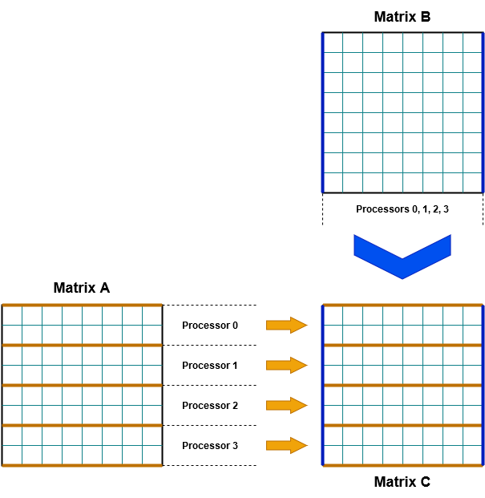

# Parallel Matrix Multiplication

### Corso di Programmazione Concorrente, Parallela e su Cloud

### Università degli Studi di Salerno - Anno Accademico 2017/18

#### Prof. Vittorio Scarano

#### Dott. Carmine Spagnuolo

#### Roberto Gagliardi - matr. 0522500543

## Problema

La moltiplicazione tra una matrice A di dimensioni *M x N* e una matrice B di dimensioni *N x L* risulta in un una matrice C di dimensioni *M x L*, così come viene raffigurato di seguito.


## Soluzione

Il programma C esposto nel file [MatrixMultiplication.c](src/MatrixMultiplication.c) fornisce una soluzione al problema della **moltiplicazione tra due matrici** quadrate di dimensioni *N x N*.

Tale soluzione si serve del **calcolo parallelo**, suddividendo il carico di lavoro su più processori utilizzando delle operazioni di comunicazione collettiva fornite da **MPI**, come le funzioni di `broadcast`, `scatter` e `gather`. Il calcolo del prodotto avviene assumendo che le dimensioni delle matrici siano divisibili per il numero di processori coinvolti nell'operazione, così da poter garantire l'assegnamento dello stesso carico di lavoro a ciascun processore.

In particolare, la soluzione prevede che ogni processore abbia il compito di calcolare una porzione della matrice risultante C. Per fare questo, il processore master, dopo aver inizializzato le due matrici da moltiplicare, invierà ad ogni altro processore un sottoinsieme della matrice A e l'intera matrice B.

In questo modo, tutti i processori (compreso il master) potranno calcolare la propria parte della soluzione, che consiste in un sottoinsieme delle righe della matrice C. Fatto questo, ogni processore invierà tale risultato al master, che avrà il compito di assemblare tutte le porzioni del risultato in un'unica matrice finale. Il procedimento appena descritto è illustrato dalla figura sottostante.



Nel caso in cui le matrici fornite non siano quadrate o che le loro dimensioni non siano divisibili per il numero di processori stabilito, il programma si arresterà e non procederà al calcolo del risultato.

## Implementazione

### Inizializzazione

La prima parte della soluzione prevede tutte le opportune inizializzazioni dell'**ambiente MPI**, così da recuperare il numero di processori e il rango di quello corrente.

```c
// Initialize MPI environment
MPI_Init(&argc, &argv);

// Get number of processes
int world_size;
MPI_Comm_size(MPI_COMM_WORLD, &world_size);

// Get rank of process
int rank;
MPI_Comm_rank(MPI_COMM_WORLD, &rank);
```

Successivamente, si passa a recuperare la **dimensione delle matrici** e a verificare che essa sia **divisibile** per il numero di processori. Oltre a questo, si procede a determinare anche il numero di righe della matrice A che, in seguito, saranno assegnate a ciascun processore. Tale valore si ottiene semplicemente dividendo la dimensione delle matrici per il numero di processori.

```c
// Dimensions
int size = atoi(argv[1]);       // Size of both rows and columns of matrices
int s = size / world_size;      // Subset of rows per processor

// Check size of matrices
if (size % world_size != 0) {
    if (rank == 0)
        printf("Size of matrices must be divisible by the number of processors");
    MPI_Finalize();
    return 0;
}
```

Dopodiché, il programma si occupa di **allocare la memoria** necessaria da destinare alle matrici.

```c
// Matrices allocation
int **matrixA, **matrixB, **matrixC;
matrixA = (int **) malloc(size * sizeof(int *));
allocMatrix(matrixA, size, size);
matrixB = (int **) malloc(size * sizeof(int *));
allocMatrix(matrixB, size, size);
matrixC = (int **) malloc(size * sizeof(int *));
allocMatrix(matrixC, size, size);
```

La procedura seguente fa in modo che le matrici vengano allocate come un array di puntatori a **blocchi contigui di memoria**, riga per riga.

```c
// Allocation of matrix as an array of successive elements
void allocMatrix(int **matrix, int rows, int columns) {
    int *elements = (int *) malloc(rows * columns * sizeof(int));
    for (int i = 0; i < rows; i++)
        matrix[i] = &elements[i * columns];
}
```

Una volta allocata la memoria in maniera opportuna, il processore master (di rango 0) può **inizializzare** i valori delle matrici.

```c
// Master processor
if (rank == 0) {

    // Matrices initialization
    initMatrix(matrixA, size, world_size);
    printMatrix(matrixA, size, size, "First matrix");
    initMatrix(matrixB, size, world_size);
    printMatrix(matrixB, size, size, "Second matrix");

}
```

In questo caso, la funzione di inizializzazione non fa altro che assegnare ad ogni matrice dei valori compresi tra 1 e il numero totale di processori. Con la funzione di stampa, invece, si provvede a mostrare a video le due matrici che saranno moltiplicate.

 ```c
// Initialize matrix with successive values between 1 and 'mod'
void initMatrix(int **matrix, int size, int mod) {
	for (int i = 0; i < size; i++) {
		for (int j = 0; j < size; j++) {
            matrix[i][j] = (i + j) % mod + 1;
		}
	}
}

// Print matrix with the specified name, rows and columns
void printMatrix(int **matrix, int rows, int columns, char *name) {
	printf("%s:\n", name);
	for (int i = 0; i < rows; i++) {
		for (int j = 0; j < columns; j++) {
            printf("%d, ", matrix[i][j]);
		}
		printf("\n");
	}
}
```

### Calcolo della soluzione

A questo punto, il programma procede al **calcolo della moltiplicazion**e tra le due matrici.

#### Invio della prima matrice

La prima cosa da fare è inviare a tutti i processori una *porzione* della matrice A. Per fare questo, la funzione di `scatter` mostrata di seguito fa in modo che il processore di rango 0, ovvero il master, invii a tutti gli altri processori un sottoinsieme delle righe della matrice A.

```c
// Send subset of first matrix to each other processor
MPI_Scatter(matrixA[rank * s], s * size, MPI_INT, matrixA[rank * s], s * size, MPI_INT, 0, MPI_COMM_WORLD);
```

Ricordando che:

- `rank` è il rango del processo corrente;

- `size` è la dimensione delle matrici;

- `s` è il numero di righe per ciascun processore;

la porzione della matrice da inviare viene determinata da:

- l'indice di partenza `rank * s`;

- il numero di elementi da inviare `s * size`;

In questo modo, si garantisce che a ogni processore venga inviato lo stesso numero di righe `s` e tutte le colonne della matrice A, così come stabilito dalla soluzione.

#### Invio della seconda matrice

La funzione di `broadcast` seguente, invece, fa in modo che il master invii a tutti gli altri processori la matrice B. In questo caso, la matrice viene inviata *per intero*, così da permettere a tutti di calcolare la propria parte della soluzione.

```c
// Send second matrix to each other processor
MPI_Bcast(matrixB[0], size * size, MPI_INT, 0, MPI_COMM_WORLD);
```

#### Moltiplicazione delle matrici

L'algoritmo seguente calcola la moltiplicazione tra il sottoinsieme della matrice A e la matrice B. Il risultato di questa operazione viene memorizzato nella matrice C.

```c
// Algorithm for matrix multiplication
for (int i = rank * s; i < (rank + 1) * s; i++) {
    for (int j = 0; j < size; j++) {
        matrixC[i][j] = 0;
        for (int k = 0; k < size; k++) {
            matrixC[i][j] = matrixC[i][j] + matrixA[i][k] * matrixB[k][j];
        }
    }
}
```

Da notare come anche il processore master, il cui rango è pari a 0, proceda a calcolare la propria porzione della soluzione, partendo dalla posizione `[0, 0]` della matrice. L'immagine seguente illustra le porzioni della matrice risultante C calcolate da ciascun processore.


#### Invio della soluzione

A questo punto, ogni processore è pronto ad inviare la propria parte del risultato al processore master. Per fare questo, la seguente funzione di `gather` raccoglie nella matrice C del master tutte le porzioni calcolate da ogni altro processore.

```c
// Receive result matrix by each other processor
MPI_Gather(matrixC[rank * s], s * size, MPI_INT, matrixC[rank * s], s * size, MPI_INT, 0, MPI_COMM_WORLD);
```

### Finalizzazione

Una volta concluso il calcolo della moltiplicazione tra le matrici, ogni processore procede a liberare la memoria allocata e a chiudere il proprio ambiente di MPI. Prima di fare ciò, il processore master si occupa di mostrare a video la matrice risultante.

```c
// Master processor
if (rank == 0) {

    // Print result matrix
    printMatrix(matrixC, size, size, "Result matrix");

}

// Free allocated memory
free(matrixA);
free(matrixB);
free(matrixC);

// Finalize the MPI environment
printf("Processor %d has done %d operations\n", rank, c);
MPI_Finalize();
return 0;
```

## Benchmark

La soluzione proposta viene valutata sulla base della **scalabilità** del programma rispetto alla capacità di calcolo impiegata e alle risorse parallele utilizzate.

Il testing è avvenuto sulla base dell'esecuzione del programma su un cluster di 8 macchine fornite da **Amazon Web Services**. In particolare, il processo di esecuzione ha previsto:

- L'inizializzazione di un cluster di 8 istanze *ec2 ami-52a0c53b* di tipo *m4.large* costituito da un nodo master e da 7 nodi slave, tramite la procedura fornita da [AWS Cluster Toolkit](https://github.com/spagnuolocarmine/aws-cluster-toolkit).

- Il trasferimento del codice sorgente dalla macchina locale all'istanza controller e da quest'ultima a tutte le istanze slave.

- L'esecuzione del programma sull'istanza controller con varie configurazioni, composte da un numero variabile di processori e da una dimensione variabile delle matrici, data dalle istruzioni seguenti.

```c
mpicc -std=c99 MatrixMultiplication.c -o MatrixMultiplication
mpirun -np NUM_PROCESSORI --host IP_MASTER,IP_SLAVE1,IP_SLAVE2,...,IP_SLAVE7 MatrixMultiplication
```

Il **tempo di esecuzione** del programma viene ottenuto grazie all'utilizzo della funzione ` MPI_Wtime `, così come illustrato di seguito. In particolare, il tempo di esecuzione del programma viene considerato come la differenza tra:

- Il tempo di inizio, calcolato subito prima che il processore master invii le matrici agli altri processori.

- Il tempo di fine, calcolato subito dopo che il processore master abbia ricevuto la matrice risultante dagli altri processori.

```c
// Time of start processing
double startTime = MPI_Wtime();

// Send subset of first matrix to each other processor
MPI_Scatter(matrixA[rank * s], s * size, MPI_INT, matrixA[rank * s], s * size, MPI_INT, 0, MPI_COMM_WORLD);
```

```c
// Receive result matrix by each other processor
MPI_Gather(matrixC[rank * s], s * size, MPI_INT, matrixC[rank * s], s * size, MPI_INT, 0, MPI_COMM_WORLD);

// Time of end processing
double endTime = MPI_Wtime();
```

```c
// Print time spent
printf("The operation took %f seconds\n", endTime - startTime);
```

Per raccogliere dei risultati più affidabili, il programma è stato lanciato tre volte per ciascuna configurazione, per poi calcolare la media dei tre tempi di esecuzione rilevati.

### Risultati

La **scalabilità forte** di un programma è la sua capacità di gestire uno stesso carico di lavoro su un numero variabile di processori. Per testare il programma in esame, l'input stabilito consiste in una coppia di matrici di dimensione pari a *1680 x 1680*. Questo valore non è altro che il minimo comune multiplo dell'insieme {2, 4, 6, 8, 10, 12, 14, 16}, i cui valori rappresentano il numero di processori utilizzati per ogni singolo test. In questo modo si garantisce che la dimensione delle matrici risulti sempre divisibile per il numero di processori in esecuzione. I risultati del test vengono illustrati nel diagramma seguente, dove il tempo di esecuzione viene espresso in secondi.


Questo diagramma mostra come un numero di processori superiore a 8 comporti un aumento significativo del tempo di esecuzione e, di conseguenza, conduca ad un calo delle prestazioni del programma. Da notare, ad esempio, come la suddivisione del carico di lavoro su 10 processori comporti un tempo di esecuzione più elevato rispetto all'utilizzo di soli 4 processori paralleli. Questo potrebbe essere dovuto al fatto che un numero troppo elevato di processori comporti un tempo di gestione e di comunicazione tra gli stessi troppo alto rispetto al tempo effettivamente speso nel calcolo della soluzione.

La **scalabilità debole** di un programma, invece, è la sua capacità di gestire una certa quantità di lavoro in maniera proporzionale al numero di processori utilizzati in parallelo. In questo caso, le dimensioni scelte per le matrici da moltiplicare è dato da 210 per il numero di processori; tali dimensioni crescono in funzione del numero di processori in esecuzione che, come prima, spazia in un intervallo che va da 2 a 16. Il risultato di quest'analisi viene mostrato dal diagramma seguente.


Tale diagramma mostra un aumento del tempo di esecuzione nel caso in cui il carico di lavoro aumenti in maniera proporzionale al numero di processori utilizzati. Tale aumento avviene in modo contenuto nel caso di un numero di processori pari o inferiore a 8. Al contrario, al di sopra di questo valore, l'aumento dei tempi di esecuzione risulta essere molto più significativo. Da questi risultati, ancora una volta, si può evincere che un numero troppo elevato di processori in esecuzione in parallelo possa influenzare negativamente le prestazioni del programma.
